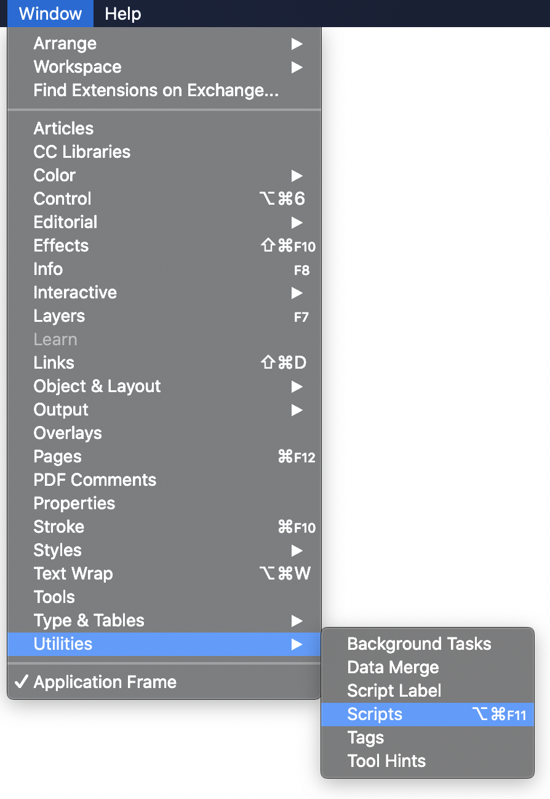
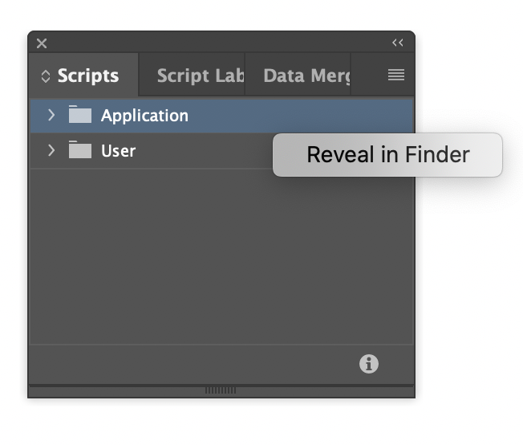
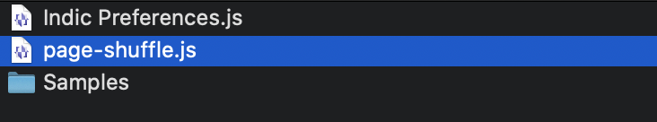
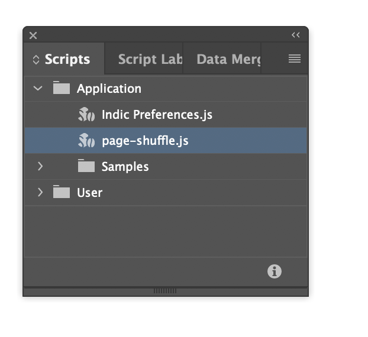
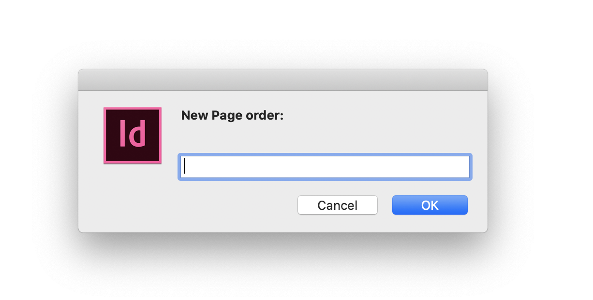
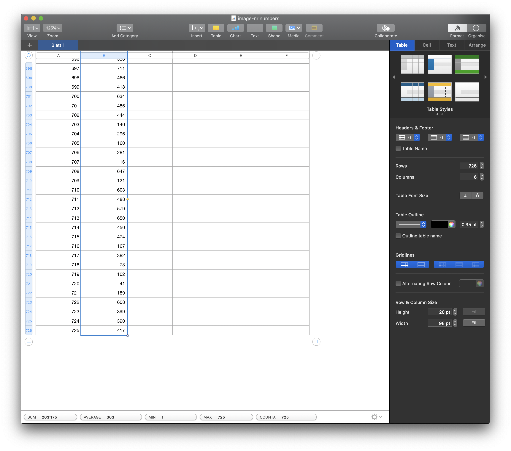
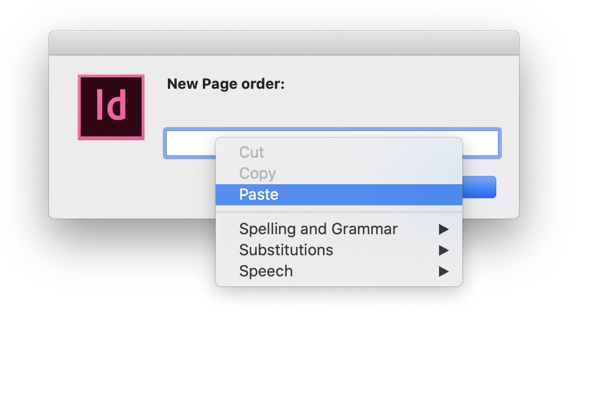
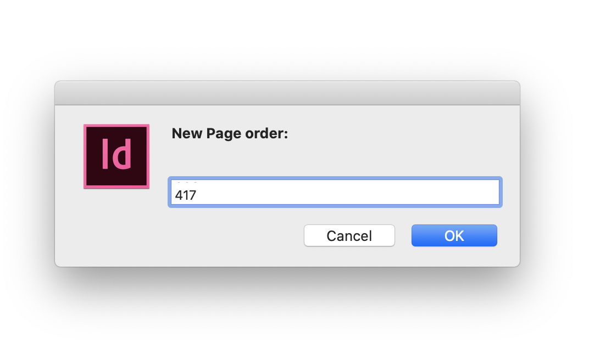

# indesign.page-shuffle
Script to suffle pages by input-index – made for sonnenzimmer. 
This script is made for InDesign. So we can not use some fancy JavaScript but just old ECMAScript 3.

## installation

### open scriptpannel

### show script location in finder

### copy script

### double click

### you get a prompt

### copy you column from numbers

### Past numbers with context-click (cmd+v doesn't work)

### the input looks weird, because you only see the last line. but all numbers are there.

### happy running...

